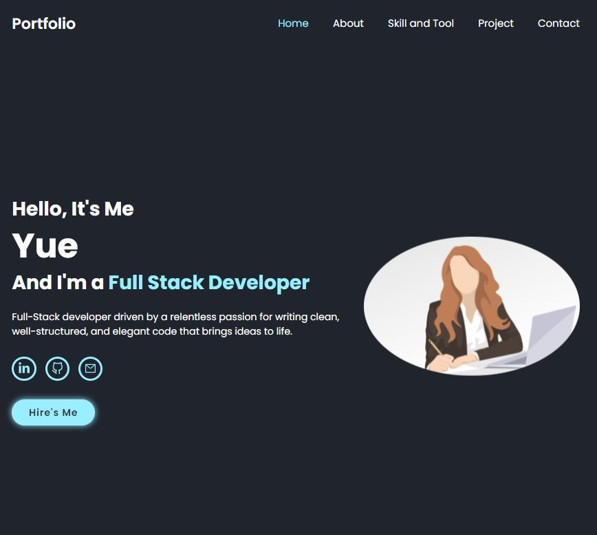

# Portafolio
 - Este proyecto es un portafolio en línea que te permitirá conocer mi trabajo como desarrolladora web Full Stack.
## Información Técnica

Metodología de Gestión:
 - Desarrollo usando la metodología de trabajo SCRUM.
 
## Tecnologías Utilizadas:
 - Frontend: Desarrollado en React,
 - Backend: Desarrollado en Spring Boot
## Operaciones CRUD:
 - El proyecto implementa un CRUD (Create, Read, Update, Delete) que permite subir proyectos a la base de datos.
 - Campos del formulario:
 - Nombre
 - Descripción
 - Imagen

## Capturas de Pantalla


# Instalación de Librerías
  ## Spring Boot
     Cloudinary

  ## React 
  ```
  npm create vite@latest
  npm install react-icons
  npm install axios
  npm install cloudinary-react
  npm install @formspree/react
```
# Se utilizan las siguientes herramientas en este proyecto:

## Trello: 
 - Utilizado para la gestión y organización de tareas y proyectos. 

## Figma: 
 - Utilizado para el diseño y prototipado de la interfaz de usuario. 
